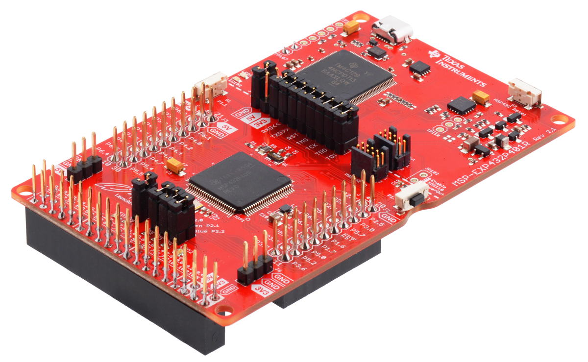

Dale Andreoli

and17081@byui.edu

Team project with Becket Fawcett and Ben Stradling

# Bean Bag Toss Game

This embedded system uses photoelectric sensors at each hole as input. The sensors are connected to an MSP432 microcontroller that keeps track of the score. The microcontroller sends information to an LCD screen to be displayed.

## Hardware

MSP432 Microcontroller

LCD Display

Photoelectric Sensors

## Diagrams and Tables

System Diagram - Sensors

LCD with Labelled Pins

LCD Pin Table

Sensor Diagram

## Code

[Click here to view](Project_Files/ECEN_361_Final_project_2020_12_07.c)

## Things we learned

* Timing systems (different methods. Ie onboard clk, delays)
* Different interrupt implementation for C/ Arduino code
* Soldering
* Adapting arduino code 
* Interfacing with different LCDs

## Some bumps we hit along the way

* Remote/ virtual coordination and testing
* Combining our C code with Energia code
* Finding proper documentation for the sensors
* Increasing the range of the sensors
* Adjusting code for a different LCD
* Implementing a timer  (using delays rather than the onboard clock)

## What could be improved

* Implement a timer( off the onboard clock - 10kHz- 48MHz )
* Battery system ( 1.7V- 3.7V)
* Full sized game ready board (Bigger holes, stronger sensors, wooden board)
* Reset Switch on the game board
* Cable management solution
* Potentiometer to control Display contrast
